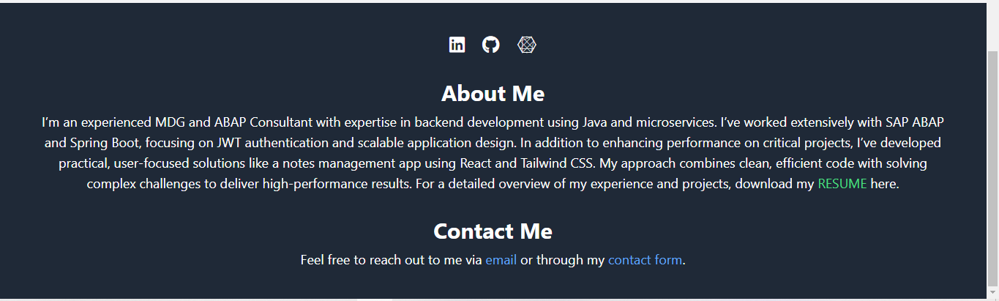
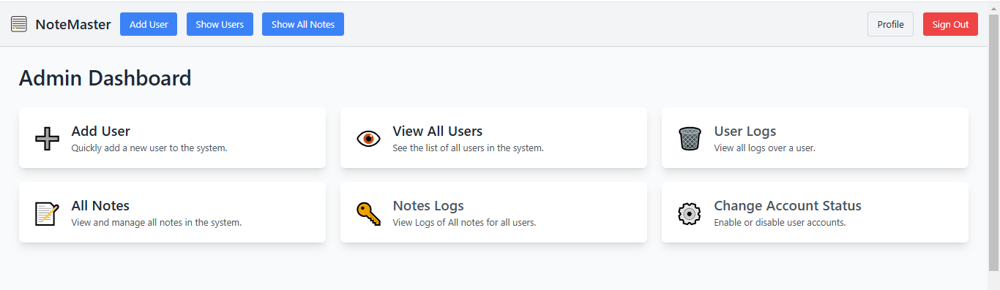

# Smart Note Management App

<!-- Description -->

A full-stack application for managing notes, built with **Spring Boot** and **React**.

## Features

- Create, Read, update, and delete notes.
- Organize notes efficiently.
- JWT token based authorization
- Super Admin and Admin user to manager users (Create, Update, Read, Delete, Activate and Lock)
- User-friendly interface with responsive design.
- Protected routes for different users(Frontend).

## Tech Stack

- **Backend:** Spring Boot (Java)
- **Frontend:** React + Vite (JavaScript)
- **Database:** Postgresql for prod environment, Mysql for Dev environment
- **Styling:** Tailwind Css

## Installation

### Backend Setup

1. Clone the repository:
   ```bash
   git clone https://github.com/KaushalPrajapat/notes-full-stack-app.git
   ```
2. Move to backend directory
   ```bash
   cd notes-app-back-end
   ```
3. Run mvn command
   ```bash
   ./mvnw spring-boot:run
   ```

### Frontend Setup

1. Move to frontend directory
   ```bash
   cd notes-app-front-end
   ```
2. install dependency
   ```bash
   npm install
   ```
3. Run file (default port is 3000)
   ```bash
   npm run dev
   ```

#### Api Test (Images)

Complete postman api config is

- Api Structure 
- Signin 
- Signup 
- validate-user 
- Get logged in user 
- Download Other Api and test: [Postman Collection](assets/zip/NOTEAPP_POSTMAN.zip)

#### Frontend (Images)

##### Public

- Home Page 
- About Section 
- Signin 
- Signup 

##### User

- All Notes 
- Add Note 
- Delete a Note 
- Edit a Note 
- Changelog of a Note 

##### Admin

- Admin Home 
- Admin profile 
- All Users Operations 

##### Super Admin

- Super Admin Home 
- Super Admin profile 
- Users all Logs 